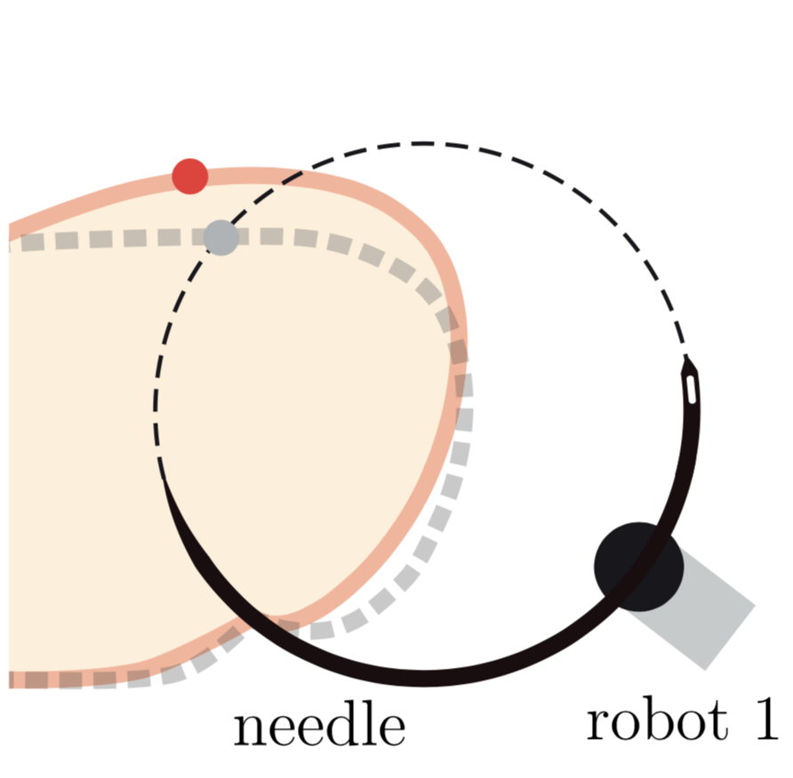
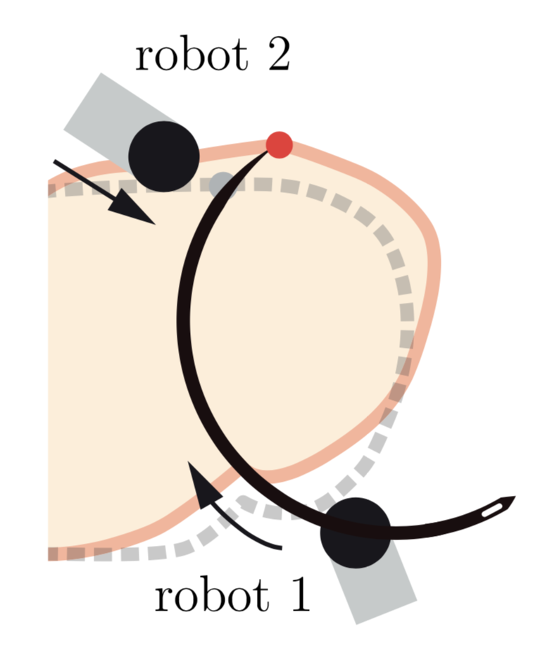
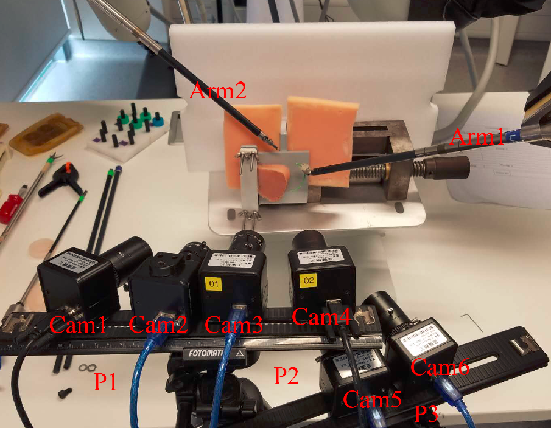
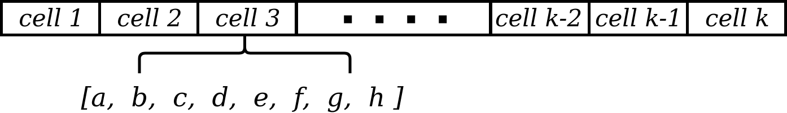

# A data-set of piercing needle through deformable objects for Deep Learning from Demonstrations

<!-- TABLE OF CONTENTS -->
## Table of Contents

* [About the Project](#about-the-project)
* [Dataset Structure](#Dataset-Structure)
* [Models](#Models)
## About The Project

Suturing is a frequently used operation in most of the surgeries and developing a robotic system for autonomous robotic suturing can be of significant assistance to surgery team in order to reduce the physical fatigue and cognitive load. Since tissues are deformable objects, needle insertion and tissue manipulation is a complex control task. During inserting the circular needle (see Fig.) into the deformable tissue, the needle tip pushes the tissue, hence, the desired and actual path differ and the actual exit-point, shown by the black-white sphere in Fig.\ref{fig::tissue}), drifts away from the desired exit-point (red sphere) resulting in a less effective grip for the stitch or (in some cases) failure of the stitch- as the stitch cuts the tissue. In practice, surgeons utilise Arm 2  to manipulate the tissue and ensure the desired and actual exit-points are the same. Surgeons only use visual feedbacks to predict the needle exit point (performed by Arm 1 in Fig.\ref{fig:setup} and \ref{fig::tissue}) and close the control loop by commanding Arm 2 to push/pool the tissue. 

  
  

The second complexity of the control task belongs to the high dimensional sensory data (Visual sensor) which makes the problem very hard for conventional control theory/Learning from Demonstration algorithms. We have collected a dataset for piercing needle into an artificial tissue with da Vinci Research Kit (DVRK) to develop deep LfD models for robot control.

## Dataset Structure

The setup includes DVRK and three pairs of stereo cameras with calibrated pose relative to robot arms' base frames. An artificial tissue made of polyethylene with homogenous texture and Young's modulus of 1.5 GPa is the flexible tissue under operation. The setup is shown in the following figure.

  

In practice, surgeons utilise Arm 2  to manipulate the tissue and ensure the desired and actual exit-points are the same. Surgeons only use visual feedbacks to predict the needle exit point (performed by Arm 1) and close the control loop by commanding Arm 2 to push/pool the tissue. Formulating such tasks and implementing the corresponding automatic controller is very complex and time-consuming. Deep Robot Learnng from Demonstration can be effectively utilized to address such a control problem.

The dataset includes 60 folders including the corresponding data for 60 successful needle insertion trials executed by an expert. In each video, the desired needle tip exit point is specified by a red cross sign and robot data are being logged after this point appears on the screen. The operation is recorded by three pairs of stereo cameras (six cameras in total) and DVRK arms synchronized joint space and end-effector data are stored. The calibration parameters which include the relative pose of two cameras in each pair and pose of each camera relative to robots' base frames are included in the dataset as well. As such, each folder include six videos corresponding to six cameras and a .mat file which contains robot stored data. The overal structure of robot data can be stated as follow:

  

a: joint space kinematic data of Arm 1 (1×6)

b: joint space kinematic data of Arm 2 (1×6)

c: pose of Arm 1 w.r.t its base frame (4×4)

d: pose of Arm 2 w.r.t its base frame (4×4)

e: pose of Arm 1 w.r.t its base frame at t+1 (4×4)

f: pose ofArm 2 w.r.t its base frame at t+1 (4×4)

g: 2D tracking target point on the image captured by 6 cameras(6×2)

h: computed 3D position of the target point w.r.t Camera 3(1×3)

The .csv format of the data are also included in the "data" folder. In the "preprocessing" folder the "all_images.py" script is used to turn videos into images with the frequency equal to the robot data logging. The images are resized into 224*224 for transfer learning purposes. 

## Models

We have developed deep models for control action generation for the robot arm which manipulates the tissue to guide the needle tip to exit from a desired specified point. As such, we have deployed state of the art CNN and RNN architectures as as feature extractor and next state predicotr respectively. The baseline methods achieved satisfactory performance based on the prediction error. The architecture of the developed models is shown in the following. 

  

In these models we make use of d and f components of robot data which contain Arm2 end-effecotr position and orientation in time step t and t+1 respectively. Camera calibration data is also concatenated with CNN laten vector and robot state vectors. For CNN block we have deployed architectures including AlexNet, VGG19, MobileNet, and ResNet. For the recurrent neural netwrok block we have used Single RNN, LSTM and GRU. Other complex models can be developed to further improve the control action generation. 
